# <mark>**<ins>Splunk Enterprise Security**
## ***<ins>analytics-driven SIEM***

## **<mark><ins>Introduction** 🖋️
Splunk is software used for searching, monitoring, and analyzing machine-generated big data, using a web-style GUI interface. 
 It captures, indexes and correlates real-time data in a searchable repository form which it can generate graphs, reports, alerts, dashboards and visualisations.
--------------------
## **<mark><ins>Splunk's core Features** 📑

| **<mark>SPLUNK FEATURE**    💬                            | **<mark>FEATURE EXPLANATION**   📝                                                               |
|-----------------------------------------------------------|--------------------------------------------------------------------------------------------------|
| **CENTRALISED EVENT AND LOG DATA COLLECTION**             | Effectiveness of real-time centralized event and log data collection                             |
| **EVENT AND LOG NORMALISATION/MANAGEMENT**                | Ability to normalize event syntax so that logs can be compared and are machine-understandable    |
| **INTEGRATION WITH IDENTITY AND ACCESS MANAGEMENT TOOLS** | Integration with access control tools like Active Directory and LDAP                             |
| **HOST AND NETWORK-BASED INTRUSION DETECTION**            | Ability to detect both endpoint intrusion and network ingress detection                          |
| **BEHAVIOURAL ANALYTICS AND BASELINING**                  | How effectively activity and behavior baselines are established and maintained                   |
| **RESPONSE ORCHESTRATION AND AUTOMATION**                 | Quality of built-in response orchestration and automation in Next-Gen SIEM                       |
| **INCIDENT INDEXING/ SEARCHING**                          | Effectiveness of searching across structured and unstructured events and incidents within SIEM   |
| **CORRELATION**                                           | Correlation of logs and events to pinpoint significant threats                                   |
| **DEPLOYMENT FLEXIBILITY**                                | Ability to tune system to maximize threat detection and minimize false positives                 |
| **CUSTOM DASHBOARDS AND WORKSPACES**                      | dashboards that can be customized to meet the needs of specific groups                           |
| **DATA INTEGRATION/API MANAGEMENT**                       | Ease and quality of data integrations between SIEM and other systems                             |
| **RULES-BASED AND ALGORITHMIC DETECTION THRESHHOLDS**     | Effectiveness of manually-established rules and algorithmically-determined detection thresholds  |
| **REPORTING AND COMPLIANCE MANAGEMENT**                   | Ease and quality of reporting and compliance functions                                           |
--------------------

## **<mark><ins>PROS** and **<mark><ins>CONS** ⚖️

| **<mark>ADVANTAGES**    👍                                                                                                                                                                                                                                                                                                                                                                                | **<mark>DISADVANTAGES**   👎                                                                   |
|-----------------------------------------------------------------------------------------------------------------------------------------------------------------------------------------------------------------------------------------------------------------------------------------------------------------------------------------------------------------------------------------------------------|------------------------------------------------------------------------------------------------|
| **Valuable Log Gathering and Summarization**   Users have expressed positive opinions about Splunk's ability to   gather and summarize log messages from multiple sources.   Many reviewers find this feature valuable, as it   allows them to easily access and analyze log data in a centralized location without the need for manual aggregation.                                  | Effectiveness of real-time centralized event and log data collection                           |
| **Simplicity and Advanced Search Capabilities**   Splunk's reporting functionality is highly regarded by users for its simplicity and advanced search capabilities. Several reviewers appreciate how easy it is to use Splunk's reporting features, while also being able to perform complex searches that provide detailed insights into their data.                                             | Ability to normalize event syntax so that logs can be compared and are machine-understandable  |
| **Effective Web Traffic Catching and Dashboards**   The effectiveness of Splunk in catching web traffic and providing helpful dashboards is another aspect praised by users. Many reviewers highlight how Splunk's web monitoring capabilities enable them to track website activity effectively, while the intuitive dashboards allow for quick visualization and analysis of important metrics. | Integration with access control tools like Active Directory and LDAP                           |

--------------------
## **<mark><ins>Recommendations** ⭐

- [ ] **<mark>Ensure the correct subscription:** Users emphasized the importance of having the correct subscription for Splunk to avoid login issues and fully utilize its features.  
  They recommend careful planning of the deployment and learning as much as possible before implementing a large installation.
- [ ] **<mark>Thoroughly investigate anomalies:** While Splunk's great dashboards for troubleshooting are praised, users advise against relying solely on system alerts generated by Splunk.  
  They suggest continuing to investigate any anomalies and carefully setting up sources and background data in Splunk.
- [ ] **<mark>Utilize Splunk's log analysis capabilities:** Many users recommend Splunk as a valuable tool for log analysis and improving the quality of current processes.  
  They find it helpful for debugging integration issues and consider it suitable for large-scale applications/systems. Users appreciate its ability to connect to individual boxes and view multiple logs simultaneously.
--------------------
## **<mark><ins>Requirements** ☑️

- A valid Splunk Enterprise license that supports approximately 300 MB to 1GB of data per filer per day.
- A Splunk Enterprise server or forwarder with network access to the NetApp storage controllers.
- Firefox (latest) / Safari (latest) / Chrome (latest).
- At a minimum, a single data collection node requires:
- 4 cores - 4 vCPUs or 2 vCPUs with 2 cores with a reservation of 2 GHz
- 6GB memory with a reservation of 1 GB
- 4-10 GB of disk space
- A version of CentOS or RedHat Enterprise Linux (RHEL) that is compatible with one of the following:
  - Splunk Enterprise 8.0.0 or later.
  - A Splunk Enterprise heavy forwarder or light forwarder, version 7.3.0 or later. This is a minimum Splunk requirement for the Splunk App for NetApp Data ONTAP. You cannot use a universal forwarder.
--------------------
## **<mark><ins>Costs** 💵💶💷
This is the price for a medium-sized business, looking for a Splunk Enterprise Security solution. The prices are in Dollars, however, the region is set to United Kingdom.

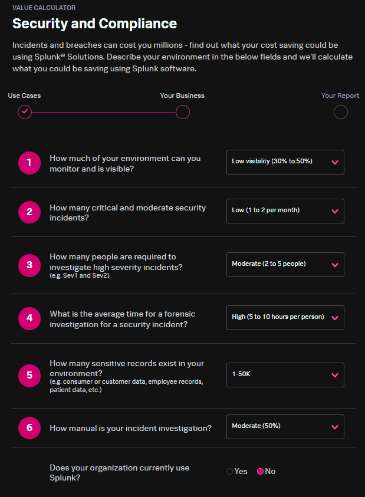
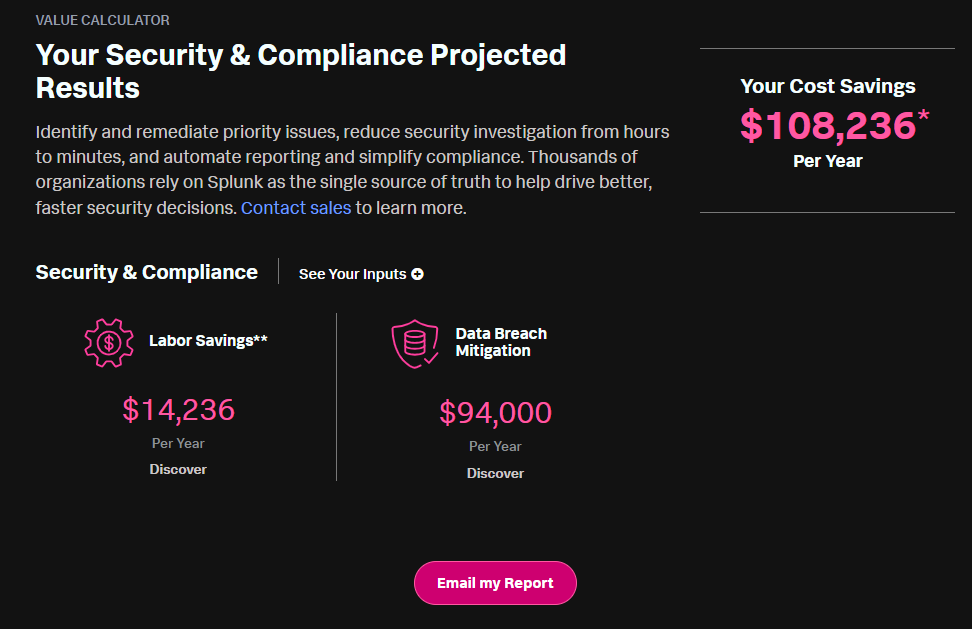

### **<mark><ins>Pricing Plans** 🛣️

| **<mark>Pricing Plan** 💬  | **<mark>How It Works** 📑                                                                                                                                                                                                                                                                         |
|----------------------------|---------------------------------------------------------------------------------------------------------------------------------------------------------------------------------------------------------------------------------------------------------------------------------------------------|
| **Workload Pricing**       | - Uses SVC (Splunk Virtual Compute), to calculate a price based on the   resources needed to drive the company's unique workflow.                                                                                                                                                             |
| **Ingest Pricing**         | - Uses volume tiers to allow for investment into Splunk based on how many gigabytes of data are ingested into Splunk per day. This volume-based pricing option is ideal when companies have a strong data strategy, clear, predictable use cases, and understand which data is most valuable. |
| **Entity Pricing**         | - Based on the number of hosts using Splunk observability products.                                                                                                                                                                                                                               |
| **Activity-based Pricing** | - Costs relate directly to activities monitored by Splunk observability products like metric time series (MTS), traces analyzed per minute, sessions or uptime requests.                                                                                                                          |

--------------------
## **<mark><ins>Overall ratings** 💯
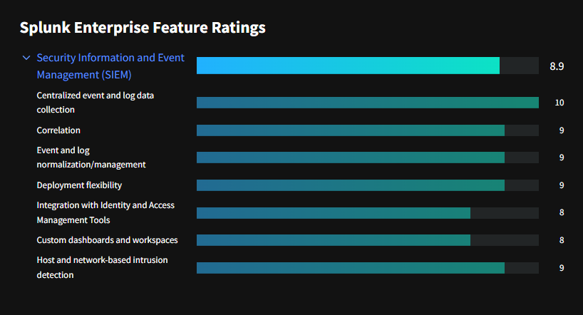
--------------------
## **<mark><ins>Likelihood to Recommend** 🤝
Splunk Enterprise is well-suited for any requirement to aggregate vast sums of data, no matter how structured or unstructured, and search across it all at speed, or report on it with visualizations, etc.

It's not suited for scenarios where you want to report on a single set of data, say, in a traditional way, for example, a typical scheduled report out of a finance system.

--------------------
## **<mark><ins>Splunk Enterprise demo** 🧑‍🏫
The image below shows the administrator login page for Splunk Enterprise ⤵️
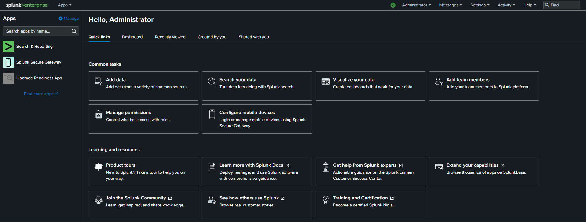
--------------------
Splunk Enterprise gives you options from where you can import or add data. The different options 
allow admins to add data from various directories and locations and analyse different types of data, 
such as network information, cloud data, operating system data, and security information.
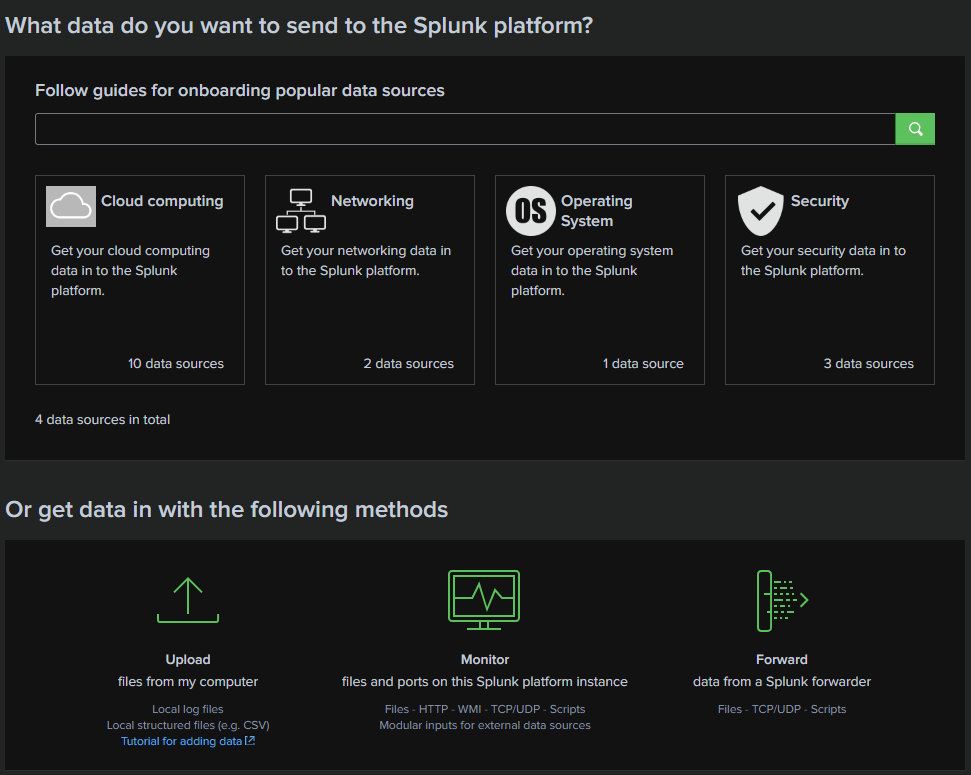
--------------------
To demonstrate how adding data into Splunk works, I will add a tutorial.zip file which was downloaded from Splunk documentation.
We can upload .zip files into Splunk and it will automatically decompress the file and ingest it normally. 
Splunk will take you through the data adding process.
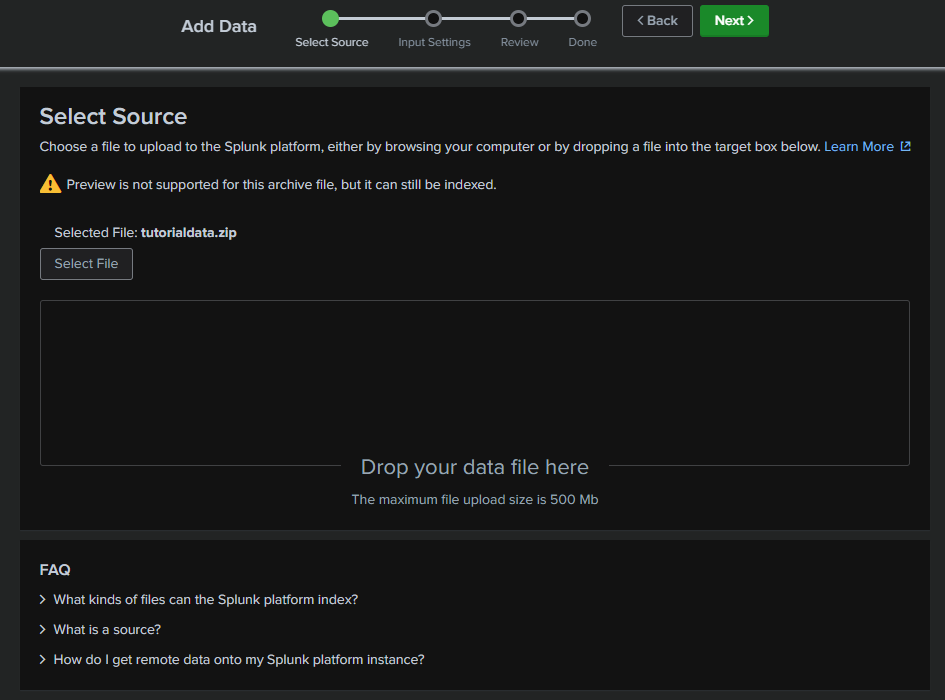
--------------------
- We then select the input settings, which allows you to set what the host does when the data is added.
- The format of the data is the source type. Leaving it as 'automatic' means Splunk can unzip the file or look at the log file formats inside it, 
and apply the appropriate source type. 
- The host value is just the name of the local host; in my case, this is 'shonepious'. 
- Indexing indicates where Splunk will store the new information. We can create a new Index location named 'test' for example, however, I will keep teh default
settings - this indexes the data in the main folder.  
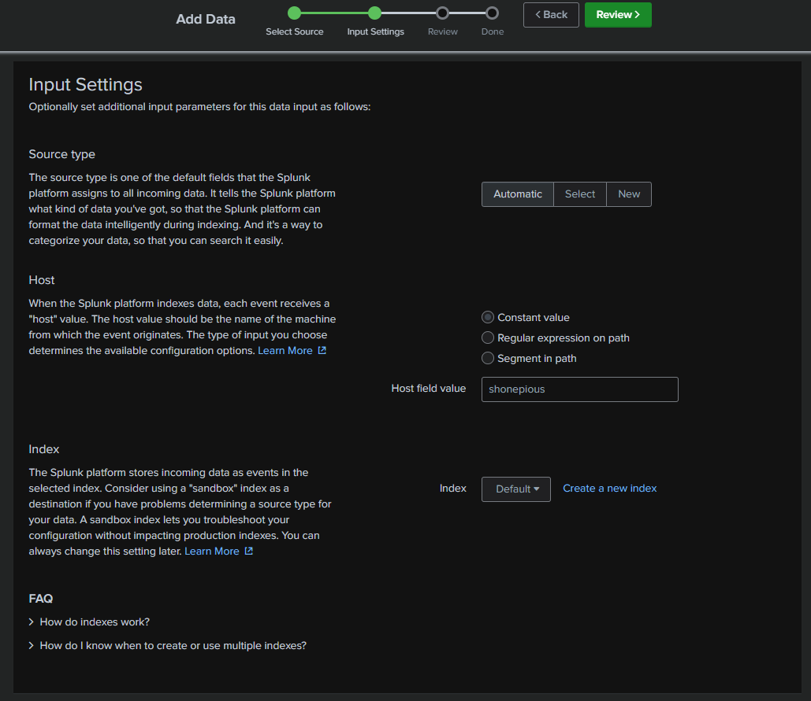
--------------------
Splunk will then give a final opportunity, to review our choices and submit the data entry.

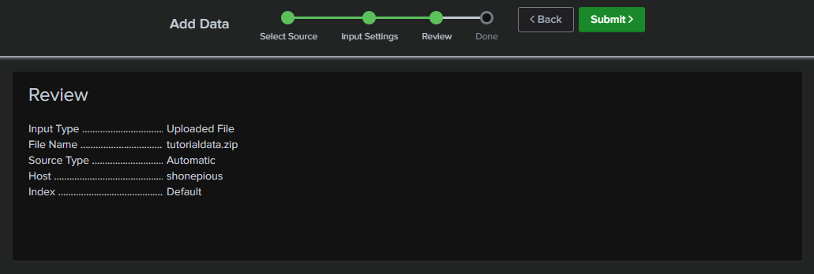
--------------------
You can use search queries to manipulate the displayed data, to fine tune analysis.
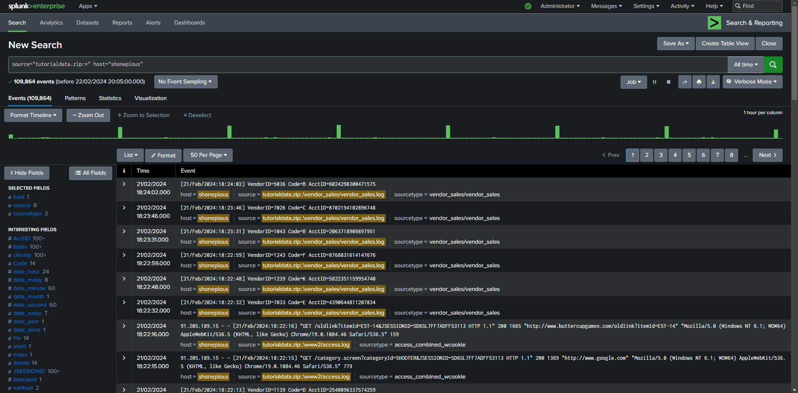
--------------------
The search bar also allow boolean logic queries and parameters, which let you filter the data and further narrow your dataset for accurate and efficient analysis. 
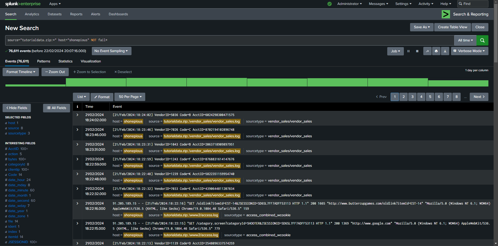
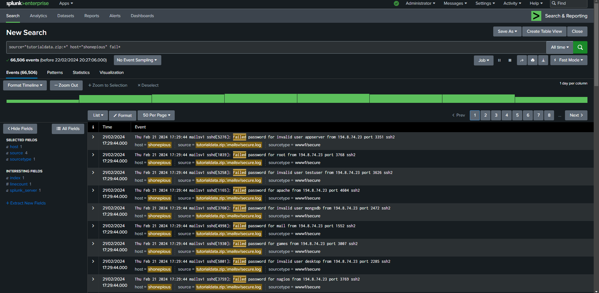
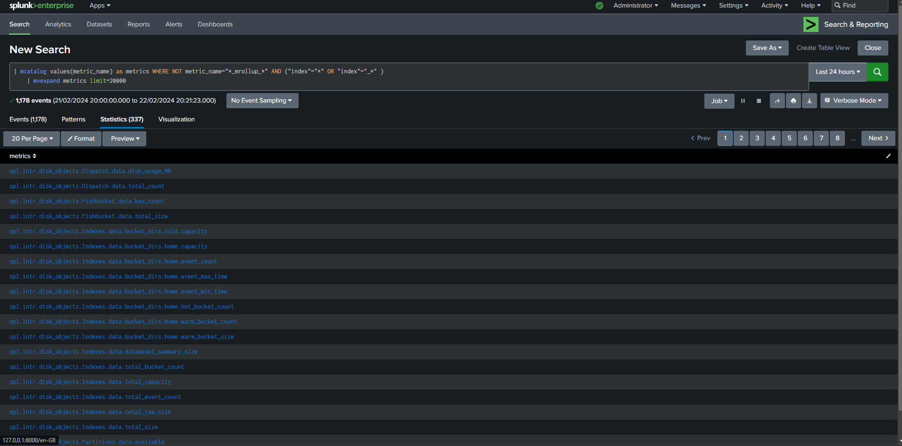
--------------------
Splunk Enterprise saves any data that you have added to an index file. You then have the ability, to create a custom
dashboard with this dataset for easy searching and analysis later.
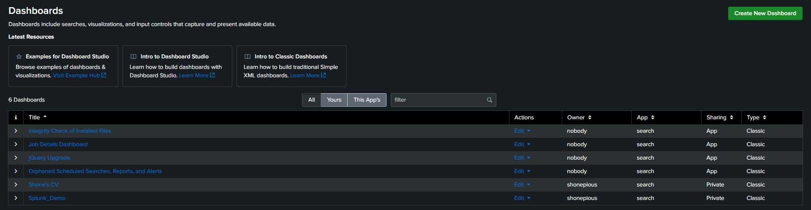
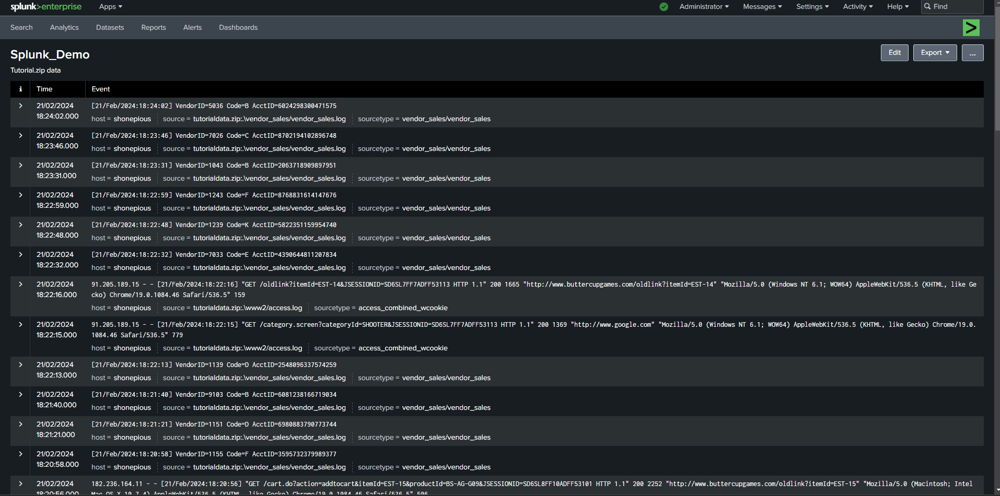
--------------------
